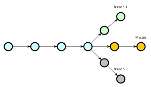

# GIT - What is it and understanding some common terminologies.

First of all, **GitHub is not git**. GitHub is a website for hosting projects that use git. 

Git is a type of version control system (VCS) that makes easier to track changes to your files. For example, when you edit a git file, it can help you track who made what changes and why. It also helps you revert back to any point in the history of the code in case you run into some issues later on.

It becomes extremely useful when you are working on a project in a group, as it helps tracking progress over time by saving checkpoints and track what everyone is working on.

To install git I have added a small installation guide for windows and linux [link](../setup/git_setup.md)

Now lets understand some basic terminology of Git and understand how it works exactly.

## Terminology
Here’s the git terminology:

- **Repository** - The git project folder is called a git repository.

- **Branch** - A branch in the repo is like another world. A person working in one branch of the repo can switch to another and hence work there without affecting anything on the other branch. Once satisfied the user can merge these branches together.


Hence as seen in the above image there are three branches -  the master branch, branch1 and branch2 all independent of one another.

- **master** - the repository’s main branch. Generally, the final working code is in this branch and various other branches are used for working on something which are finally merged to the master.

- **clone** - copies an existing git repository, normally from some remote location(online) to your local environment(personal system).
  
- **add** - staging changed files on the local repository for commiting.

- **commit** - submitting the files onto the local repository is called a commit. Hence a user needs to first add a file before commiting it.

- **fetch or pull** - fetch command is used to get the latest changes from the remote to the local repository. This doesn't reflect the changes on the local repository untill we **merge** these changes. The difference between fetch and pull is that the **pull command** does the work of both fetch and merge in one go. Hence its always recommended to first fetch the changes review them before merging on the local repository.


- **push** - is used to send the changes on the local repository onto the remote environment. 

- **remote** - these are “remote” locations of your repository, normally on some central server like in this case the GitHub website.

- **head** - is a reference to the node to which our working space of the local repository is at. Hence whenever we switch branches the head moves to the next branch. Similarly after every commit, the head points to the next commit. Therefore the head points to the current location of the code we are in the whole working tree.


**Difference between fork and clone**:

Whenever we fork a repository, it gets created as a repository on your GitHub profile as well. Now a user can make his/her changes/commits on to this forked repository without disturbing the main repository. Now if the user wants to contribute to the main repository or fix some bugs, he/she can make a **pull request** to the original repository so that the maintainers of that repository can review your changes and also ensure that there are no conflicts. Once there are no issues, the maintainers of the original repository can merge these changes on to the main repository.
A clone on the other hand will download a .git repository from the internet (GitHub) to your computer and extract the latest snapshot of the repo (all the files) to your working directory.

## Understanding some basic commands in git command line:

```git init``` - used to initalise a folder on your local machine as a git repository. It creates a .git folder which tracks all the changes in the folder.

```git clone <repositorylink>``` - used to clone a repository from GitHub to your local machine. For example:
```git clone https://github.com/analytics-club-iitm/Daily-Sessions.git```

```git status``` - to view the current status of your local repository. It shows the unstaged files, modified files, etc.

```git add <file-name>``` - used to add a file to the staging area for commiting. 

```git commit -m "commit-message"``` - used to commit the files on the staging area to the local repository. The commit message is used to track your commits by acknowledging the changes made.

```git push <remote-name> <branch-name>``` - used to push the changes to the local repository to the online repository.
Generally, the remote corresponding to the online repository is referred by **origin** and the branch to which we are pushing to is referred to by the branch name.

```git checkout -b <branch-name>``` - used to create a new branch called branch-name and move the HEAD to that location.

```git checkout <branch-name>``` - used to switch to an already existing branch.

```git checkout <file-name>``` - to reset a particular file called file name to the last commit.

```git fetch <remote-name> <branch-name>``` - to fetch the latest changes from the online repository.

```git log --all --oneline --decorate``` - to view the log of the different commits and branches, the current position of the HEAD, etc in a nice tree format.

```git merge <remote-name> <branch-name>``` - to merge the changes from last fetch to the local repository.

## For a detailed list of commands please refer to :
https://github.com/MukundVarmaT/Git--Notes/blob/master/git-notes.md

Also have a look at these amazing tutorials - https://www.youtube.com/watch?v=uR6G2v_WsRA

## Please checkout the [link](submit_task.md) for an illustration as to how to use git to submit a task. 