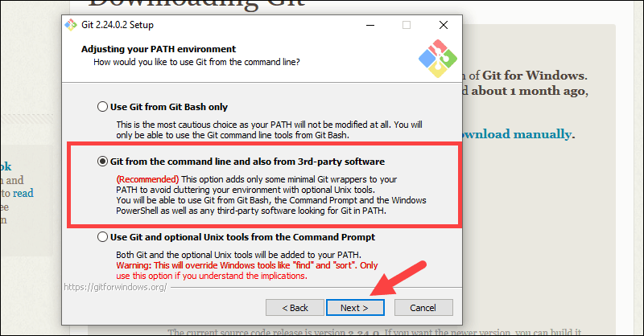
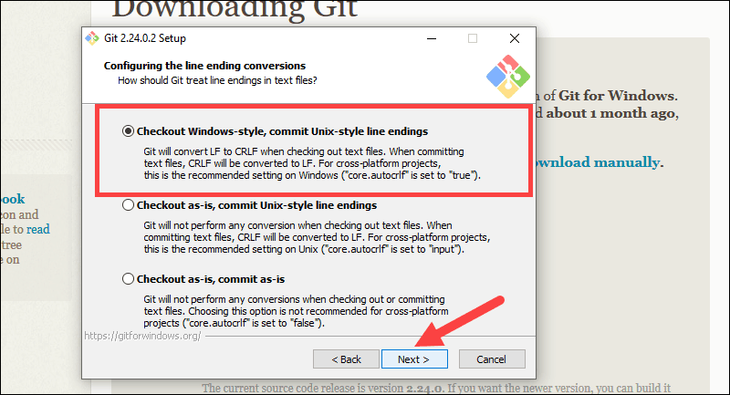

# GIT Command Line Setup on Windows and Linux

## Windows:

-  Browse to the official Git website: https://git-scm.com/downloads
- Click on the installer once the download completes to complete the installation process.

**Some points to note here:**

While going through the installation proceedure make sure to check the following steps. **The remaining can be done as per the recommended ones.**





Next open your command line terminal ( command prompt or the powershell )

- To check your installation write ```git --version```

If installation happened succesfully version number should come on the screen.

- Next to set up your git credentials :
   
  ```git config ––global user.name “github_username”```

  ```git config ––global user.email “email_address”```

------

## Linux:

All you need to do is :

```sudo apt-get install git```

And if you have run the script on the repo you don't need to do this as well and git would have already been installed.
